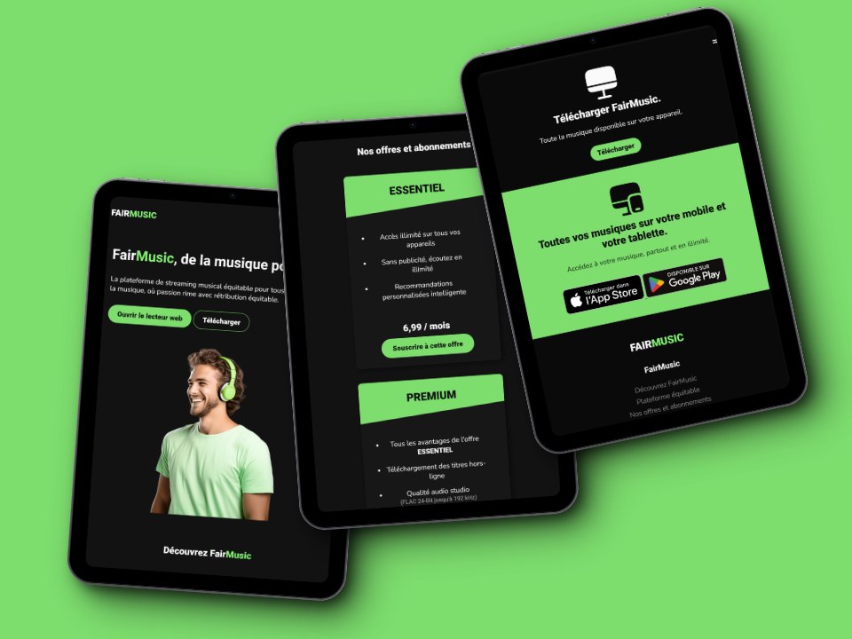

# FairMusic : Music Streaming Platform - Project
## Introduction

Welcome to the Music Streaming Platform project! This is a fictitious static website created for educational purposes. The goal of this project is to present a concept for a fair and equitable music streaming platform for both artists and music enthusiasts. The website presents the concept, features, offers and subscriptions available.

## Table of contents
- [Links](#links)
- [Screenshots](#screenshots)
- [Technologies used](#technologies-used)
- [Lighthouse report](#lighthouse-report)

## Links
- Live view of the website : [Click here](https://johanchereau.github.io/fairmusic-showcase/)

## Screenshots
### Mobile view

### Tablet view

### Laptop views

## Technologies Used

- **HTML**: Used for structuring the content of the web pages.
- **CSS**: Used for styling and layout of the web pages.
- **JavaScript**: Used for adding interactivity and dynamic behavior to the website.
- **Figma**: Used for designing the user interface and creating mockups.
- **Lighthouse**: Used for testing the performance and accessibility of the website.

## Lighthouse report

